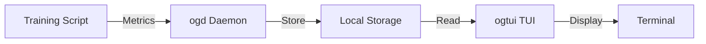

OpenGraphs (og) is a local-first experiment tracking tool designed for AI/ML engineers who need to monitor training runs in real-time over SSH. Built with Rust for performance, it provides a terminal user interface (TUI) that works seamlessly in remote environments.

## What is OpenGraphs?

OpenGraphs is an experiment tracking system that runs entirely in your terminal. Unlike cloud-based solutions, it stores all data locally and provides real-time visualization of metrics without requiring a web browser or internet connection.

The tool consists of two core components:
- **ogtui**: Terminal user interface for visualizing metrics and logs
- **ogd**: Daemon for collecting metrics and system stats

## Key features

### Local-first architecture

All experiment data is stored locally on your machine. No external dependencies, no cloud uploads, and no network requirements beyond SSH.

### Real-time metric visualization

Watch your training metrics update in real-time with live graphs rendered directly in your terminal. Track loss, accuracy, learning rate, gradient norms, and custom metrics.

### System monitoring

Automatic collection of GPU stats (temperature, utilization, memory, power) and CPU/RAM metrics alongside your training metrics.

### SSH-friendly

Designed to work over SSH connections with minimal bandwidth. The TUI is optimized for remote sessions and handles network latency gracefully.

### Multiple runtime backends

Run experiments locally or on remote compute platforms:
- `local`: Run on your current machine
- `modal`: Run on Modal compute (adapter in development)

### Built-in AI agent

Optional AI agent that can analyze your training runs and suggest hyperparameter improvements based on metric trends.

## Use cases

<Note>
OpenGraphs is ideal for ML engineers who spend most of their time in the terminal and prefer local tooling over cloud dashboards.
</Note>

### Training run monitoring

Track multiple experiments across different projects with automatic organization by timestamp and run ID.

### Hyperparameter tuning

Compare metrics across runs to identify optimal hyperparameters. Use the built-in comparison commands to analyze performance.

### Remote compute tracking

Monitor long-running training jobs on remote servers over SSH without needing to expose web ports or set up port forwarding.

### System resource optimization

Correlate training performance with GPU/CPU usage to identify bottlenecks and optimize resource utilization.

## Architecture overview

OpenGraphs uses a daemon-based architecture for efficient metric collection:

### Components

**Training script integration**

Your Python training script reports metrics using the `og_agent_chat.client` module or writes to TensorBoard format.

**Metric collection (ogd)**

The daemon collects metrics from your script and system stats (GPU/CPU), storing them in a structured format.

**Visualization (ogtui)**

The TUI reads stored metrics and renders live graphs, logs, and system stats in your terminal.

### Data flow

1. Run your training script with `og run demo_train.py`
2. Script reports metrics via Python client or TensorBoard
3. ogd daemon collects and stores metrics locally
4. ogtui displays real-time graphs and logs
5. All data stored in `runs/` directory structure

## Next steps

<CardGroup cols={2}>
  <Card title="Install OpenGraphs" icon="download" href="/installation/curl-installer">
    Get started with the curl installer or npm
  </Card>
  <Card title="Quick start" icon="rocket" href="/quickstart">
    Run your first experiment in minutes
  </Card>
</CardGroup>